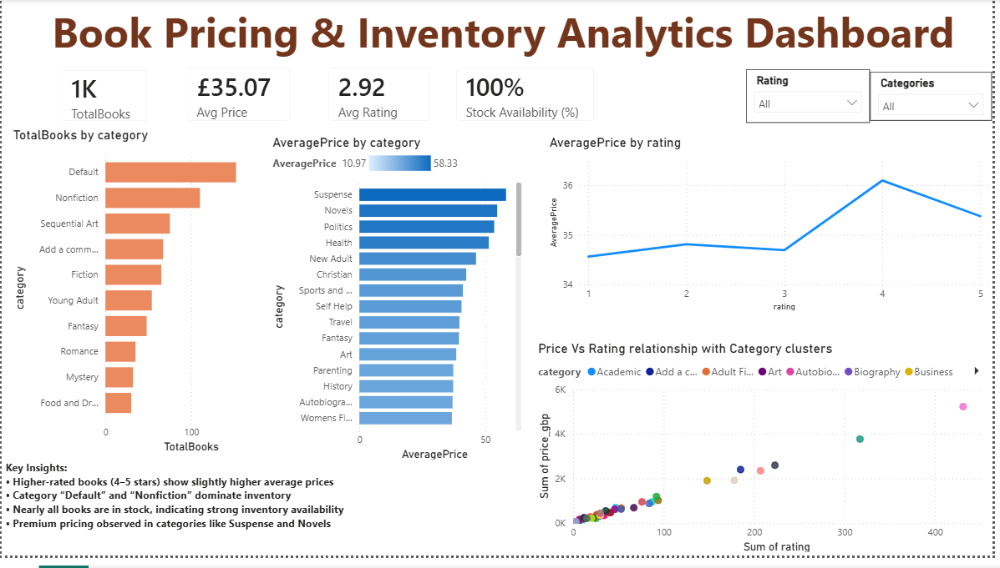

# 📊 Book Pricing & Inventory Intelligence

🚀 End-to-End Data Engineering + Data Analytics Project  
(Web Scraping | SQL Server | Power BI)

## 📊 Dashboard Preview

## 📌 Project Overview

This project simulates a real-world e-commerce analytics pipeline where data is collected, processed, analyzed, and visualized to generate business insights.

The goal is to understand pricing trends, category performance, and inventory availability using a complete data workflow.

## 🏗️ Project Architecture

Web Scraping (Python) → Data Cleaning (Pandas) → SQL Server → Power BI Dashboard

## 🛠️ Tech Stack

- Python (Requests, BeautifulSoup, Pandas)
- SQL Server (SSMS)
- Power BI (DAX, Visualization)
- GitHub (Version Control)

  ## ⚙️ Data Engineering Workflow

- Scraped data from an e-commerce website using Python  
- Parsed HTML using BeautifulSoup  
- Cleaned and transformed data using Pandas  
- Stored structured data in SQL Server  
- Created reusable datasets for analysis

  ## 🧮 SQL Analysis

Performed queries to:

- Calculate average price by rating  
- Identify top-performing categories  
- Analyze inventory distribution  
- Evaluate pricing trends across categories

  ## 📊 Power BI Dashboard

This dashboard provides insights into:

- Pricing trends by rating  
- Category-level performance  
- Inventory availability  
- Product distribution  

### 🔑 Key Insights

- Higher-rated books (4–5 stars) tend to have higher prices  
- Categories like *Default* and *Nonfiction* dominate inventory  
- Inventory availability is nearly 100%  
- Premium pricing observed in categories like Suspense and Novels

  ## 💼 Business Impact

- Helps identify premium product segments  
- Supports pricing strategy decisions  
- Improves inventory visibility  
- Enables data-driven decision making

## ▶️ How to Run

1. Clone the repository  
2. Run Python scripts to scrape data  
3. Load data into SQL Server  
4. Open Power BI dashboard file  
